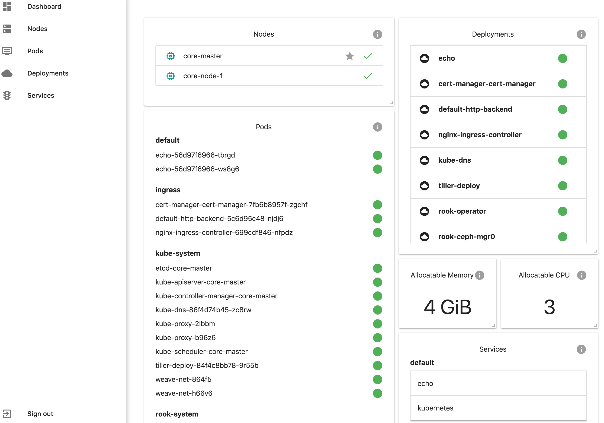
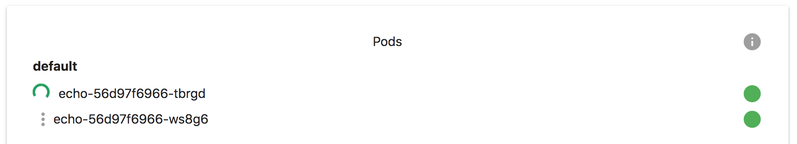
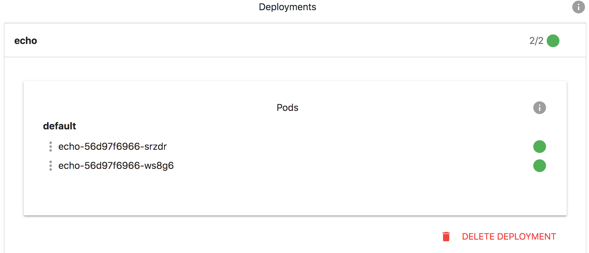

# Kubefront - Simple k8s cluster management

**Project vision**

Kubefront is a dashboard for Kubernetes clusters that simplifies cluster management. The development of kubefront is taking place as a part of a course in advanced web programming at Linköping University. Kubefront allows an administratior to manage and monitor the cluster. Kubefront can be safely exposed publicly and be used by people with limited knowledge of Kubernetes.

> **Note!** This project is currently in development. I advice against using it in production environments until this warning has been removed as testing is still ongoing. Please leave any feedback as an issue. 

## Status of the project

### 2018-04-26

Most of the groundwork for the platform has been laid. Authentication, background workers, upstream via WebSockets, Pub/Sub implementations for pushing events, sync between sessions, live data representation and more has been implemented. There are some limitations in all of this, I did not fully think through how 'namespace' driven k8s is, some endpoints needs to be refactored to better support objects with same name but in different namespaces. Also, permission control should be more similar to k8s RBAC, at the current stage it is endpoint driven. So the connection there highly depends on how the endpoints are written. There are still some faults in the backend and crashes can occurr.

The live data representation is working very well, the frontend is very well synced with the k8s cluster and changes are pushed almost immediately. The Pub/Sub implementation very well supports this in keeping the number of triggered events down depending on what is actually on screen. So no matter if you use `kubectl` or kubefront, the state is always the same.

The dashboard contains a collection of components, they can be resized and moved around. The layout is stored and it will render the same when the page is refreshed.

The workers are doing their job. Whenever a job is running on an object there is an indicatior showing that the resource is 'busy'. This also syncs live between sessions and renders correctly even if the frontend is fully refreshed. The image shows a deletion job being run on a pod causing the menu to be blocked. Users cannot accedently try to do two things at the same time on the same resource. This avoids someone else trying to use a resource as it is being for example deleted by someone else.

The pods component can be re-used with label-selectors which makes if appear in the deployment view, showing only pods for this deployment. 

Code still needs to be refactored and some parts needs to be re-designed to better support scaling out to more k8s components. 

## Requirements and tech

**Functional requirements**

*User can*

- [x] Run Kubefront and access the Web UI
- [x] Basic auth system and ability to sign in as administrator
- [ ] Create manage and delete other user accounts
- [x] See basic statistics from the cluster
- [x] Live data for statistics
- [x] See and manage running pods
- [x] See and manage running deployments
- [x] See and manage services
- [ ] See and manage ingresses

**Technological specification**

- Vue is used on the client side. All client-side programming is made in JavaScript and packed in Webpack as part of standard Vue procedures. View components are split when relevant.
- Go is used as the backend programming language acting as an authenticator and mediator between the client-side and Kubernetes API. Because authentication is built into the backend the backend can safely be exposed outside the cluster.
- The backend runs in a Docker container. It can connect to a cluster from within the cluster or externally through the Kubernetes API. Because of this it can be run locally and be connected to a remote cluster. 
- Custom built bash scripts to simplify building, running, deploying and testing kubefront will be made.
- Kubefront workers (go routines launced from the Kubefront API) will be used to make async tasks for the user.
- Live communication with clients using websockets.
- To make sure that live communication is fluent and not overflowed a pub/sub system will be made to allow frontend to toggle listeners to topics. When the client subscribes to a topic it will receive broadcasts from that topic, when it unsubscribes the broadcasts will stop.

The image below explains how the Kubefront architecture looks like.

