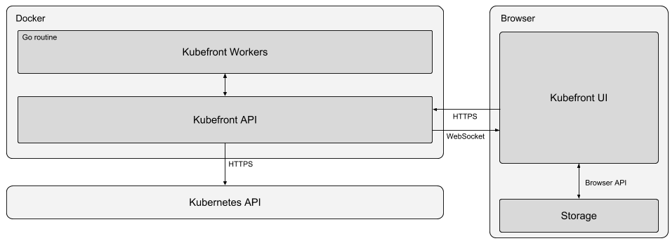

# Kubefront - Simple cluster management

**Project vision**

Kubefront is a dashboard for Kubernetes clusters that simplifies cluster management. The development of kubefront is taking place as a part of a course in advanced web programming at Linköping University. Kubefront allows an administratior to manage and monitor the cluster. Kubefront can be safely exposed publicly and be used by people with limited knowledge of Kubernetes.

**Functional requirements**

*User can*

- [x] Run Kubefront and access the Web UI
- [x] Basic auth system and ability to sign in as administrator
- [ ] Create manage and delete other user accounts
- [ ] See basic statistics from the cluster
- [ ] Live data for statistics
- [ ] See and manage running pods
- [ ] See and manage running deployments
- [ ] See and manage services
- [ ] See and manage ingresses

**Technological specification**

- Vue is used on the client side. All client-side programming is made in JavaScript and packed in Webpack as part of standard Vue procedures. View components are split when relevant.
- Go is used as the backend programming language acting as an authenticator and mediator between the client-side and Kubernetes API. Because authentication is built into the backend the backend can safely be exposed outside the cluster.
- The backend runs in a Docker container. It can connect to a cluster from within the cluster or externally through the Kubernetes API. Because of this it can be run locally and be connected to a remote cluster. 
- Custom built bash scripts to simplify building, running, deploying and testing kubefront will be made.
- Kubefront workers (go routines launced from the Kubefront API) will be used to make async tasks for the user.
- Live communication with clients using websockets.

The image below explains how the Kubefront architecture looks like.

